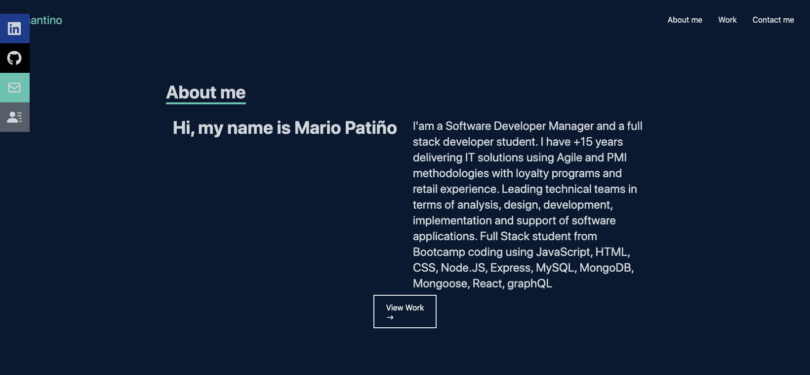
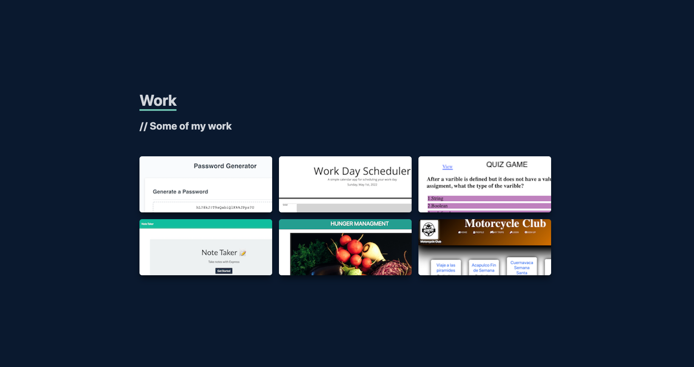
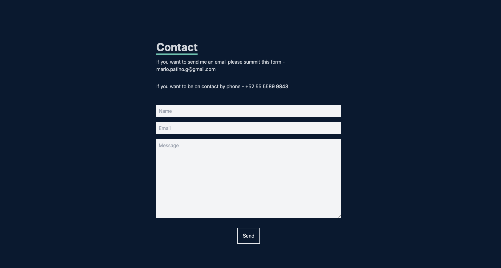

# React Portafolio App

# Description
This is a react App portafolio to show my development work, it has some cool animation on the buttons and navigation. I seach for ideas in internet and I found a tutorial to create this Web App, i use windTail framework for CSS, it was a excelent tool and make easy add styles to any element. Instead of use a classic foot the tutorial teachs to contruct a buttons left element, so I use it, it is completly funtional. I enjoy to learn a new framework and the construction was easy and funny.
It is completly responsive an it was contructed mobile first.
This project was bootstrapped with [Create React App](https://github.com/facebook/create-react-app).

  
## Table of Contents
* [Description](#description)
* [Usage](#usage)
  
    ## License 
    This project is license under the "https://opensource.org/licenses/MIT"
* [Installation](#installation)
* [Tests](#tests)
* [Motivation](#motivation)
* [Contact](#contact)

## Current Web app screenshoots

## Usage
    All visitor can navitate to know basic professional data and check out some on myh project, each project has a hover with two buttons one for test the Web App and other for view the code at git hub. It Also has a contact form, it currently not working but in the future it will send an email. It is easy to add a new card to show more projects and it is responsive.

## License
    MIT

## Installation
    Create the proper directories for css and script and the index.html

## Test
   Ones you have the code just in terminal commands use "npm start", it also open [http://localhost:3000](http://localhost:3000) to view it in your browser, do not forget to run "npm install" and check all dependecis in the package.json
   

## Technologies Used

* JavaScript
* CSS - Bootstrap and tailWind
* Node.js
* React

## Autor
    For any question or inquiery
* GitHub: [mariopatino](https://github.com/mariopatino)

## Available Scripts

In the project directory, you can run:

### `npm start`

The page will reload when you make changes.\
You may also see any lint errors in the console.

### `npm test`

Launches the test runner in the interactive watch mode.\
See the section about [running tests](https://facebook.github.io/create-react-app/docs/running-tests) for more information.

### `npm run build`

Builds the app for production to the `build` folder.\
It correctly bundles React in production mode and optimizes the build for the best performance.

The build is minified and the filenames include the hashes.\
Your app is ready to be deployed!

See the section about [deployment](https://facebook.github.io/create-react-app/docs/deployment) for more information.

### `npm run eject`

**Note: this is a one-way operation. Once you `eject`, you can't go back!**

If you aren't satisfied with the build tool and configuration choices, you can `eject` at any time. This command will remove the single build dependency from your project.

Instead, it will copy all the configuration files and the transitive dependencies (webpack, Babel, ESLint, etc) right into your project so you have full control over them. All of the commands except `eject` will still work, but they will point to the copied scripts so you can tweak them. At this point you're on your own.

You don't have to ever use `eject`. The curated feature set is suitable for small and middle deployments, and you shouldn't feel obligated to use this feature. However we understand that this tool wouldn't be useful if you couldn't customize it when you are ready for it.

## Learn More

You can learn more in the [Create React App documentation](https://facebook.github.io/create-react-app/docs/getting-started).

To learn React, check out the [React documentation](https://reactjs.org/).

### Deployment

This section has moved here: [https://facebook.github.io/create-react-app/docs/deployment](https://facebook.github.io/create-react-app/docs/deployment)

### `npm run build` fails to minify

This section has moved here: [https://facebook.github.io/create-react-app/docs/troubleshooting#npm-run-build-fails-to-minify](https://facebook.github.io/create-react-app/docs/troubleshooting#npm-run-build-fails-to-minify)
